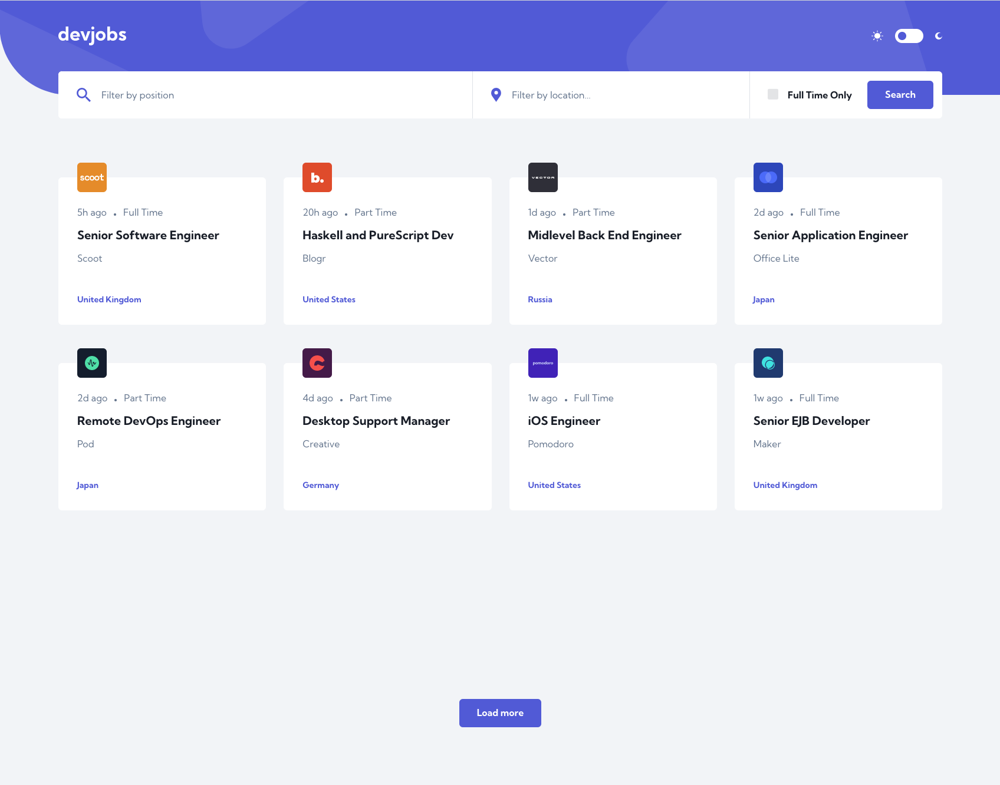
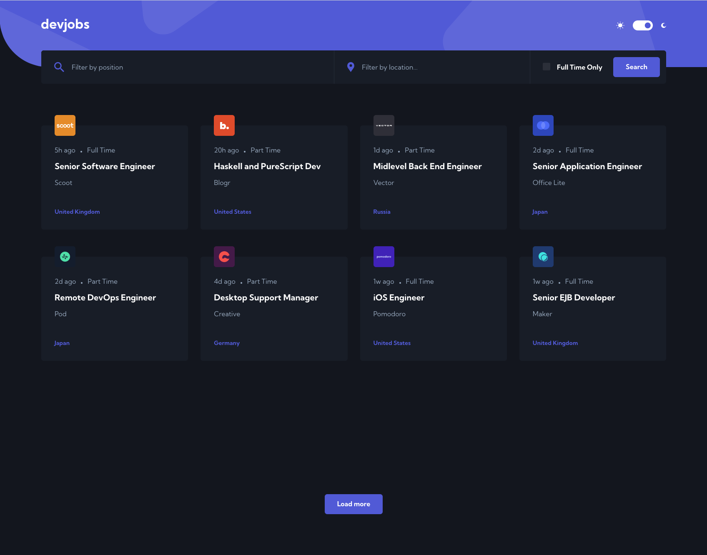
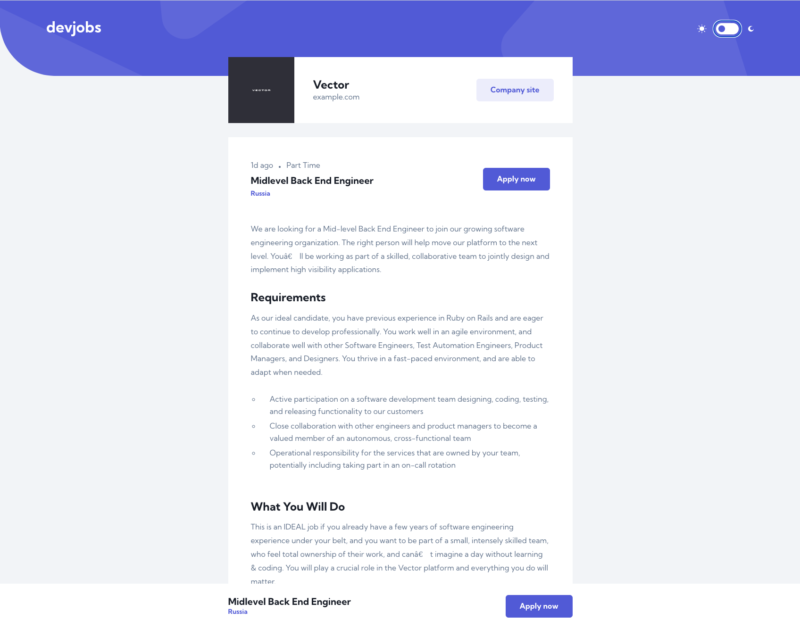
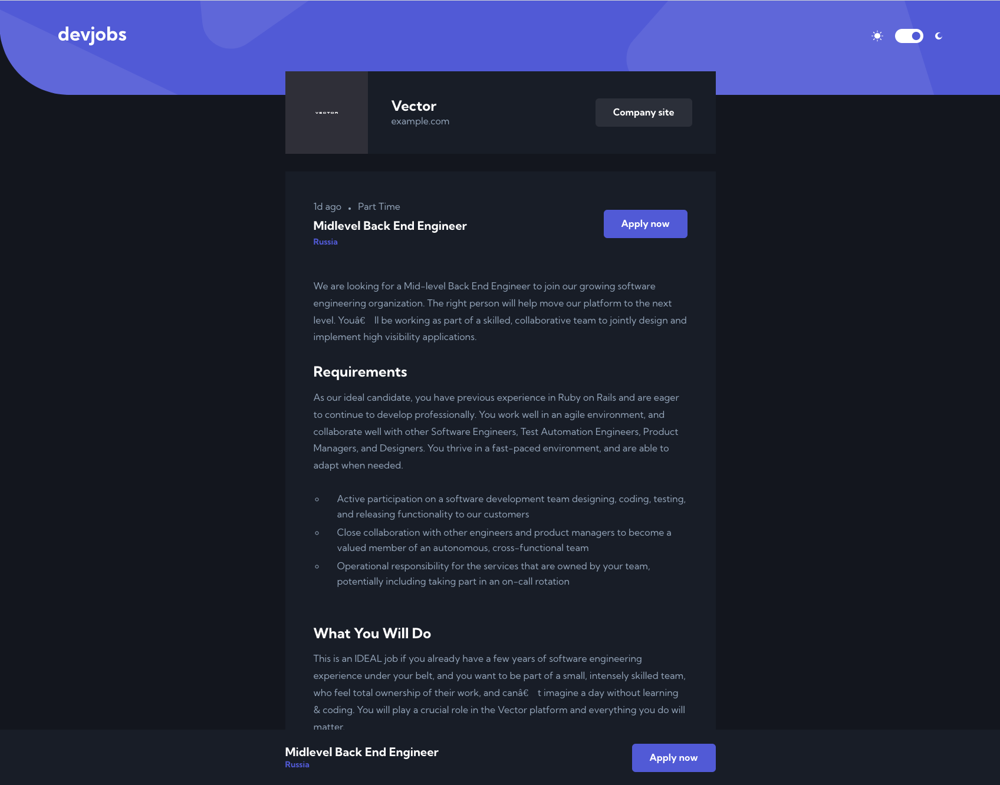
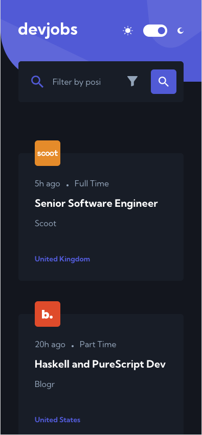
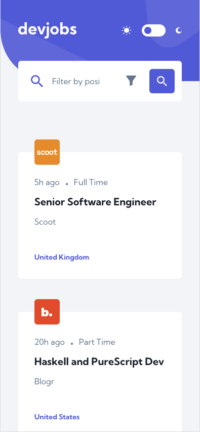
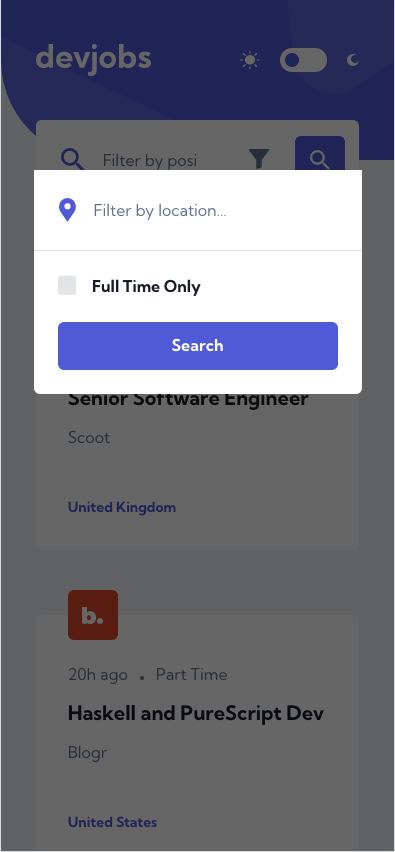
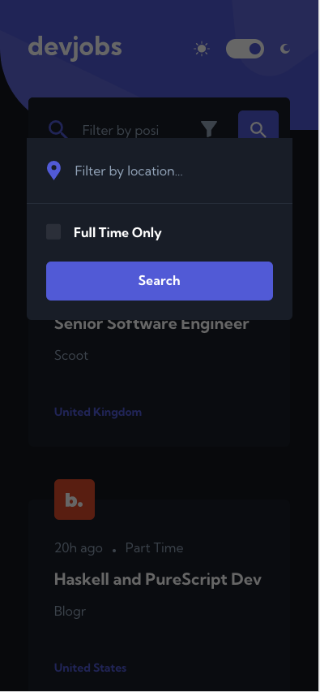

# Frontend Mentor - DevJobs fullstack web app

This is a solution to the [Devjobs web app challenge on Frontend Mentor](https://www.frontendmentor.io/challenges/devjobs-web-app-HuvC_LP4l). Frontend Mentor challenges help you improve your coding skills by building realistic projects.

## Start project

```bash
# Install client & server dependencies
npm install && cd client && npm install && cd ..

# Start Dev server: http://localhost:3000
npm run dev
```

## List of npm scripts

Scripts name          | Description                                                      
:------------------|:----------------------------------
`npm run dev`           | runs node.js server and then client dev server(preferable)
`npm run server:start`  | run node.js server
`npm run client:start`  | run client dev server
`npm run check`         | checking node.js and npm versions
`npm run preview`       | run horoku preview before deploy for production
`npm start`             | starting node.js server in production mode

## Table of contents

  - [Overview](#overview)
    - [The challenge](#the-challenge)
    - [Screenshot](#screenshot)
    - [Links](#links)
  - [My process](#my-process)
    - [Built with](#built-with)
  - [Author](#author)

## Overview

### The challenge

Users should be able to:

- View the optimal layout for each page depending on their device's screen size
- See hover states for all interactive elements throughout the site
- Be able to filter jobs on the index page by title, location, and whether a job is for a full-time position
- Be able to click a job from the index page so that they can read more information and apply for the job
- **Bonus**: Have the correct color scheme chosen for them based on their computer preferences. _Hint_: Research `prefers-color-scheme` in CSS.
- **Bonus**: Build this project as a full-stack application

### Screenshot










### Links

- Solution URL: [Github](https://github.com/Ex-Zy/devjobs)
- Live Site URL: [Heroku](https://devjobs-v.herokuapp.com/)

## My process

### Built with

- Server: Express.js
- Client: Vite, Vue 3(composition api), VueRouter, PostCss, CSS Grid, Flexbox, Html5, Custom Properties, Custom media

## Author

- Website - [Sergey Nagornykh](https://nagornykh.me/)
- Github - [Ex-Zy](https://github.com/Ex-Zy)
- Frontend Mentor - [@Ex-Zy](https://www.frontendmentor.io/profile/Ex-Zy)
